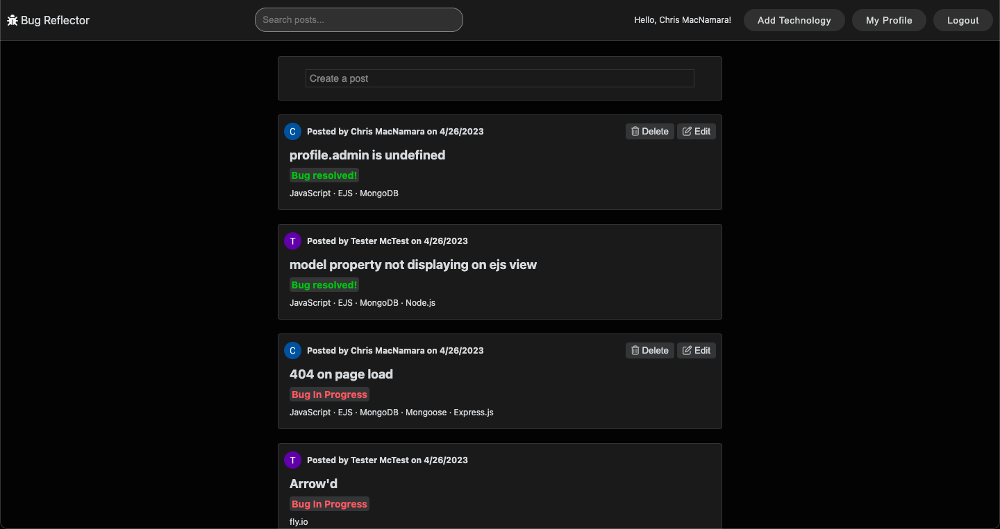

# Bug Reflector

Bug Reflector is a blog-like app designed to give developers a space to log and reflect upon bugs that they encounter. It also allows users to comment on one another's posts so that users can build a supportive, reflective community. I believe deeply in the power of self-reflection. As a developer, carefully articulating one's bugs and their solution is an invaluable practice that can dramatically boost one's coding proficiency. This practice also helps developers become better mentors and fosters clear and effective communication between developers.

The app also allows users to view other users' profiles which contain a list of their posts. Users can also search all posts for specific keywords and phrases.

## Getting Started
## [Access the app here!](https://bug-reflector.fly.dev/)
View this project's planning materials, wireframes, and ERD diagrams [here](https://trello.com/b/nyWyQOFy/bug-reflector)

## Attributions
Bug Reflector uses a bug favicon created by Muhammad Tajujin available from [flaticon](https://www.flaticon.com/free-icon/bug_3024112?term=bug&page=1&position=37&origin=search&related_id=3024112)

Bug Reflector uses a landing page image created by Andrew Neel available from [unsplash](https://unsplash.com/photos/9moikpaufvg)

Bug Reflector uses the Rubik Pixels font created by Nan and Like Prowse available from [Google Fonts](https://fonts.google.com/share?selection.family=Rubik%20Pixels)

Bug Reflector uses the IBM Plex Sans font created by Mike Abbink and Bold Monday available from [Google Fonts](https://fonts.google.com/share?selection.family=IBM%20Plex%20Sans)

## Technologies Used

- Node.js
- Express.js
- JavaScript
- EJS
- CSS
- Git
- Google OAuth
- MongoDB and Mongoose
- fly.io

## Next Steps
- [ ] Add light mode.
- [ ] Add a favoriting feature to posts.
- [ ] Add a tag system to posts.
- [ ] Add a follower system.
- [ ] Add a filtering feature to the list of posts.
- [ ] Add a profile customization feature.
- [ ] Add the ability to add code snippets to posts.
- [ ] Add nested replies to comments.
- [ ] Add a language model that will allow users to indicate/track their proficiency in various languages.
